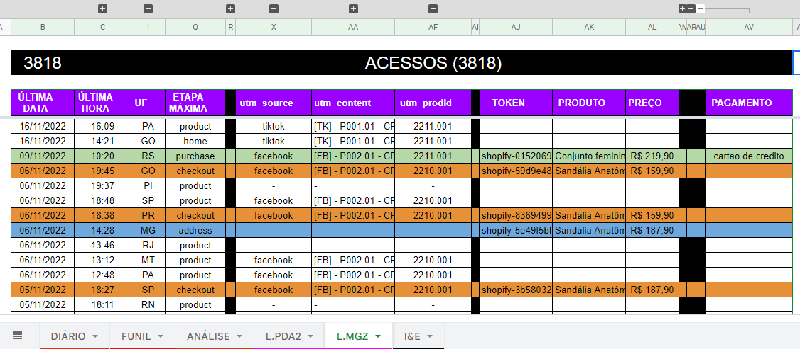

<a name="TOC"></a>

<h3 align="center">
  SHOPIFY STORE OMNI PIXEL
</h3>

<div align="center">
  <a href="https://www.npmjs.com/package/shopify-store-omni-pixel"></a>
  <a href="https://nodejs.org/en/"></a>
  <a href="https://www.github.com/lucasvtiradentes/shopify-store-omni-pixel/commits/master"></a>
  <br>
  <a href="#"></a>
  <a href="https://www.github.com/lucasvtiradentes"></a>
  <a href="https://github.com/lucasvtiradentes/shopify-store-omni-pixel#contributing"></a>
</div>

<p align="center">
  <a href="#dart-features">Features</a> • <a href="#warning-requirements">Requirements</a> • <a href="#bulb-usage">Usage</a> • <a href="#wrench-development">Development</a> • <a href="#books-about">About</a> • <a href="#family-community">Community</a>
</p>

<details>
  <summary align="center"><span>see <b>table of content</b></span></summary>
  <p align="center">
    <ul>
      <li><a href="#dart-features">Features</a></li>
      <li><a href="#warning-requirements">Requirements</a></li>
      <li><a href="#bulb-usage">Usage</a></li>
      <li>
        <a href="#wrench-development">Development</a>
        <ul>
          <li><a href="#development-setup">Development setup</a></li>
          <li><a href="#used-technologies">Used technologies</a></li>
          <li><a href="#commit-messages-style">Commit messages style</a></li>
        </ul>
      </li>
      <li>
        <a href="#books-about">About</a>
        <ul>
          <li><a href="#license">License</a></li>
        </ul>
      </li>
      <li>
        <a href="#family-community">Community</a>
        <ul>
          <li><a href="#contributing">Contributing</a></li>
          <li><a href="#feedback">Feedback</a></li>
        </ul>
      </li>
    </ul>
  </p>
</details>

<a href="#"></a>

## :trumpet: Overview

This is a tool for saving user behavior information into cookies and send events to some ads and analytics platforms, like GA, Facebook and Tiktok.

<div align="center"></div>

This tool is an must-have for [shopify stores](https://www.shopify.com/) who uses [yampi](https://www.yampi.com.br/) as payment checkout solution, since it saves a lot of effort in proper setup analytics tracking in all ads platforms and yampi don't track user checkout progress correctly.

To unlock its full potential, consider using also [lvt-analytics-setup](./docs/setup%20lvt%20analytics.MD).

## :dart: Features<a href="#TOC"></a>

&nbsp;&nbsp;&nbsp;✔️ Track user information across all ecommerce funnel and store it at cookies;<br>
&nbsp;&nbsp;&nbsp;✔️ Sends user events to regular analytics pixel platforms, like google analytics, facebook, tiktok, and others;<br>
&nbsp;&nbsp;&nbsp;✔️ Saves user visits in a google spreadsheets sheet;<br>
&nbsp;&nbsp;&nbsp;✔️ Increases store speed by handling all the pixels with an timeout delay;<br>
&nbsp;&nbsp;&nbsp;✔️ Make the analytics tracking setting fast for developers;<br>
&nbsp;&nbsp;&nbsp;✔️ Run the latest version of the code in your stores as soon as you update the code in your github;<br>
&nbsp;&nbsp;&nbsp;✔️ Supported analytics platforms events: Google analytics 3, Google analytics 4, Microsoft clarity and lvt analytics.<br>
&nbsp;&nbsp;&nbsp;✔️ Supported ads platforms events: Google ads, Facebook, Tiktok ads.<br>

## :warning: Requirements<a href="#TOC"></a>

In order to use this project in your computer, you need to have the following items:

- [npm](https://www.npmjs.com/): To install the package. Npm is installed alongside nodejs;
- [nodejs](https://nodejs.org/en/): To actually run the package.

If you want to make changes to the source code, it is recommended to also install the following items:

- [git](https://git-scm.com/): To work with version controlling;
- [vscode](https://code.visualstudio.com/): Useful for editing the code. You can choose a similar editor as you wish.

## :bulb: Usage<a href="#TOC"></a>

To be able to use this tool, first include the following snippet code (which sets page objects used in the omni pixel source code) before in the `head` section of `theme.liquid` file in you shopify store:

```html
<script>
  LVT_collection = '';
  LVT_product = '';
  LVT_search = '';
  LVT_cart = '';
  LVT_article = '';

  var curPage = "{{template.name}}"
  // console.log(curPage)

  if (curPage === "collection"){
    LVT_collection = {{ collection.products | json }};
  } else if (curPage === "product"){
    LVT_product = {{ product | json }};
  } else if (curPage === "search"){
    LVT_search = {{ search.results | json }};
  } else if (curPage === "cart"){
    LVT_cart = {{ cart | json }};
  } else if (curPage === "article"){
    LVT_article = {{ article | json }};
  } else if (curPage === "index"){
  } else if (curPage === "blog"){
  } else if (curPage === "page"){
  }

  if (LVT_collection === ''){delete LVT_collection}
  if (LVT_product === ''){delete LVT_product}
  if (LVT_search === ''){delete LVT_search}
  if (LVT_cart === ''){delete LVT_cart}
  if (LVT_article === ''){delete LVT_article}
</script>
```

And after, make sure to edit the missing pieces in the following snippet code, and after include it after the above code. Its better to include the following snippet code in a `google tag manager` tag, since GTM is compatible with both shopify and yampi platforms, and whe need to track customer
actions in Yampi too.

```html
<script type="text/javascript">
  var github_username = 'lucasvtiradentes';
  var github_repository = 'shopify-store-omni-pixel';
  var file_location = 'dist/lvt_omni_pixel.min.js';
  var final_link = 'https://api.github.com/repos/' + github_username + '/' + github_repository + '/contents/' + file_location;

  fetch(final_link)
    .then(function (response) {
      return response.json();
    })
    .then(function (data) {
      var decodedContent = atob(data.content);
      eval(decodedContent);

      runTrackerWhenReady({
        shopify_store: {
          store_name: 'storename',
          store_url: 'storename.com.br',
          checkout_url: 'seguro.storename.com.br',
          blog_url: '/blog_page_',
          tracking_url: '/tracking_page',
          contact_url: '/contact_page',
          skip_cart: true,
          ignored_collections: ['20 OFF', 'HOT SALES']
        },
        pixel_settings: {
          lvt: {
            fire_events: true,
            settings: {
              spreadsheet_id: '-',
              store_sheet_name: '-',
              api_url: '-'
            }
          },
          clarity: {
            fire_events: false,
            pixels: ['-']
          },
          tiktok: {
            fire_events: false,
            pixels: ['-']
          },
          facebook: {
            fire_events: false,
            pixels: ['-']
          },
          google_ua: {
            fire_events: false,
            pixels: ['-']
          },
          google_a4: {
            fire_events: false,
            pixels: ['-']
          },
          google_ads: {
            fire_events: false,
            pixels: [
              {
                pixel: '-',
                labels: {
                  purchase: ['-'],
                  add_payment_info: ['-'],
                  add_address_info: ['-'],
                  begin_checkout: ['-'],
                  add_to_cart: ['-'],
                  view_item: ['-'],
                  view_item_list: ['-'],
                  page_view: ['-']
                }
              }
            ]
          }
        }
      });
    });
</script>
```

alternatively, you can use the package directly from npm, with the following code:

```html
<script src="https://unpkg.com/shopify-store-omni-pixel@1.0.0/lvt_omni_pixel.min.js" type="text/javascript"></script>
<script src="https://cdn.jsdelivr.net/npm/shopify-store-omni-pixel@1.0.0" type="text/javascript"></script>
<script src="https://cdn.jsdelivr.net/npm/shopify-store-omni-pixel" type="text/javascript"></script>
```

## :wrench: Development<a href="#TOC"></a>

### Development setup

To setup this project in your computer, download it in this link or run the following commands:

```bash
# Clone this repository
$ git clone https://github.com/lucasvtiradentes/shopify-store-omni-pixel

# Go into the repository
$ cd shopify-store-omni-pixel
```

After download it, go to the project folder and run these commands:

```bash
# Install dependencies
$ npm install

# Run the typescript code in development mode
$ npm run dev
```

If you want to contribute to the project, after you make the necessary changes, run these commands to check if everything is working fine:

```bash
# Compile the code into javascript
$ npm run build

# Run the compiled code in production mode
$ npm run start
```

If you want to publish it to an npm package, just do the following steps:

1. Make the changes you want in the source code;
2. Login into your npm account in the terminal, using `npm login`;
3. Upgrade the `version` key for a greater one in the npm package;
4. Update the `name` key in the npm package to the name of your new package;
5. Run the command `npm run pub`.

### Used technologies

This project uses the following thechnologies:

<div align="center">
  <table>
    <tr>
      <th>Scope</th>
      <th>Subject</th>
      <th>Technologies</th>
    </tr>
    <tr>
      <td rowspan="1">Project</td>
      <td>Main</td>
      <td align="center">
        <a href="https://nodejs.org/"></a>
      </td>
    </tr>
    <tr>
      <td rowspan="3">Setup</td>
      <td>Code linting</td>
      <td align="center">
        <a href="https://github.com/prettier/prettier"></a>
        <a href="https://github.com/eslint/eslint"></a>
      </td>
    </tr>
    <tr>
      <!-- <td rowspan="3">Setup</td> -->
      <td>Commit linting</td>
      <td align="center">
      <a target="_blank" href="https://github.com/conventional-changelog/commitlint"></a>
      <a target="_blank" href="https://github.com/commitizen/cz-cli"></a>
      <!-- <a href="https://gitmoji.dev"></a> -->
      </td>
    </tr>
    <tr>
      <!-- <td rowspan="1">Setup</td> -->
      <td>Other</td>
      <td align="center">
        <a href="https://editorconfig.org/"></a>
        <a target="_blank" href="https://github.com/typicode/husky"></a>
        <!-- <a target="_blank" href="https://github.com/okonet/lint-staged"></a> -->
      </td>
    </tr>
  </table>
</div>

### Commit messages style

This project uses the best of two main conventions to commit messages validation:

- [conventional commits](https://www.conventionalcommits.org/en/v1.0.0/): it's powerfull messages structure;
- [gitmoji](https://gitmoji.dev/): it's beutiful and visual way to display commits.

So a typically valid commit message has this pattern:

> 🔧 config: add lint-staged to the project (#2)

Also, in order to have this integration working correctly, I buld a [script](../scripts/update-commits-configs.ts) that we can specify only allowed types and it take care to update both commitizen and commitlint settings.

<a href="#"></a>

## :books: About<a href="#TOC"></a>

## License

**Boilermanager** is distributed under the terms of the MIT License Version 2.0. A complete version of the license is available in the [LICENSE](LICENSE) file in this repository. Any contribution made to this project will be licensed under the MIT License Version 2.0.

<a href="#"></a>

## :family: Community<a href="#TOC"></a>

## Contributing
if you want to positivily impact this project, consider:

- **:star: Star this repository**: my goal is to impact the maximum number of developers around the world;
- ✍️ **Fix english mistakes** I might have made in this project, may it be in the DOCS or even in the code (I'm a portuguese natural speaker);
- [:heart: Say thanks](https://saythanks.io/to/lucasvtiradentes): kind words have a huge impact in anyone's life;
- [💰 Donate](https://github.com/lucasvtiradentes): if you want to support my work even more, consider make a small donation. I would be really happy!

## Feedback

Any questions or suggestions? You are welcome to discuss it on:

- [Github issues](https://github.com/lucasvtiradentes/shopify-store-omni-pixel/discussions)
- [Email](mailto:lucasvtiradentes@gmail.com)

<a href="#"></a>

<div align="center">
  <p>
    <a target="_blank" href="https://www.linkedin.com/in/lucasvtiradentes/"></a>
    <a target="_blank" href="mailto:lucasvtiradentes@gmail.com"></a>
    <a target="_blank" href="https://discord.com/users/262326726892191744"></a>
    <a target="_blank" href="https://github.com/lucasvtiradentes/"></a>
  </p>
  <p>Made with ❤️ by Lucas Vieira.</p>
  <p>👉 See also all <a href="https://github.com/lucasvtiradentes/lucasvtiradentes/blob/master/portfolio/PROJECTS.md#TOC">my projects</a></p>
  <p>👉 See also all <a href="https://github.com/lucasvtiradentes/my-tutorials#readme">my articles</a></p>
</div>
